# 第 17 章 总结和未来的安全模式

> CHAPTER 17 Summary and the Future of Security Patterns

The part can never be well unless the whole is well.

Plato

We complete our book with tables of patterns, a list of research directions, some principles for security and a look at the future.

## 17.1 Summary of Patterns

This section offers a table that summarizes all the patterns in this book. For each pattern we have listed its classification using four of the dimensions described in Chapter 2. The Intent indicates what problem is solved by the pattern, the concern is its basic type of intended function, the context describes the environment where it can be applied or the prerequisites for its use, and lifecycle indicates in what stage of the development lifecycle the pattern is useful. Other dimensions could be added, but they would clutter this table. Ideally, a complete description of each pattern should be implemented in a tool that could present the designer with the relevant patterns according to the step of the design.

We first list the security patterns presented in this book, then (page 489) the misuse patterns in the book. We have written several other security patterns, described on page 490. Finally, we security patterns under development (page 493).

### SECURITY PATTERNS DESCRIBED IN THIS BOOK

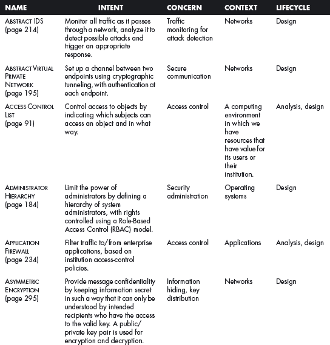

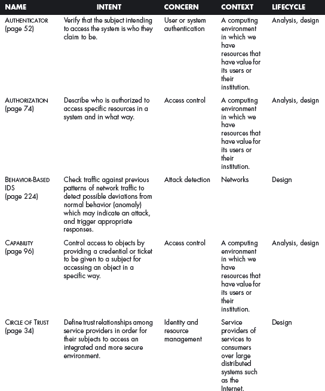

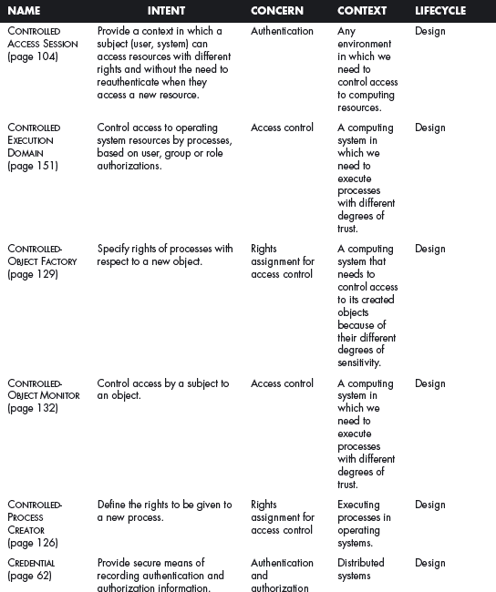

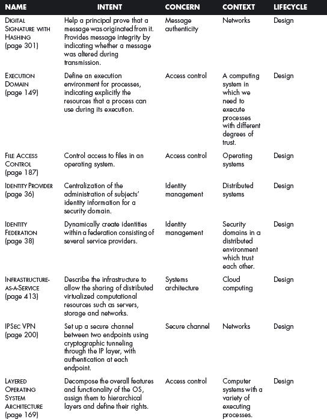

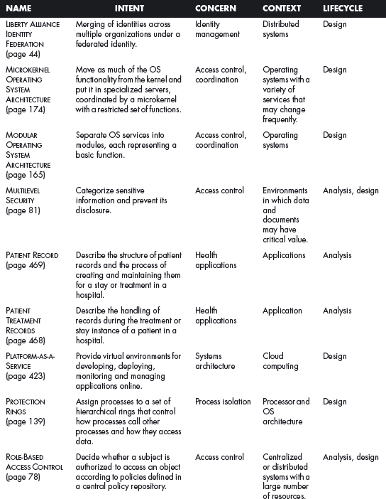

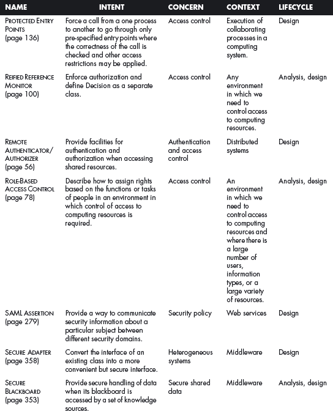

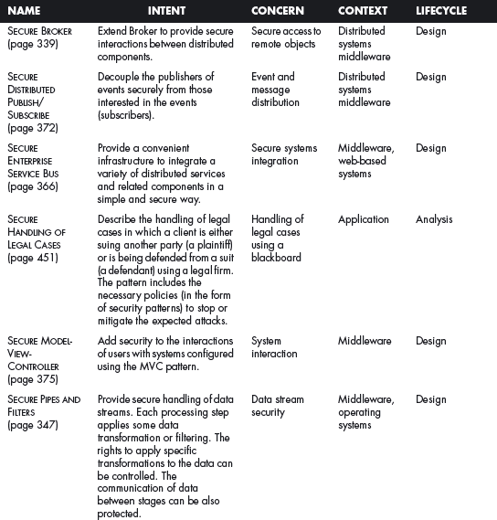

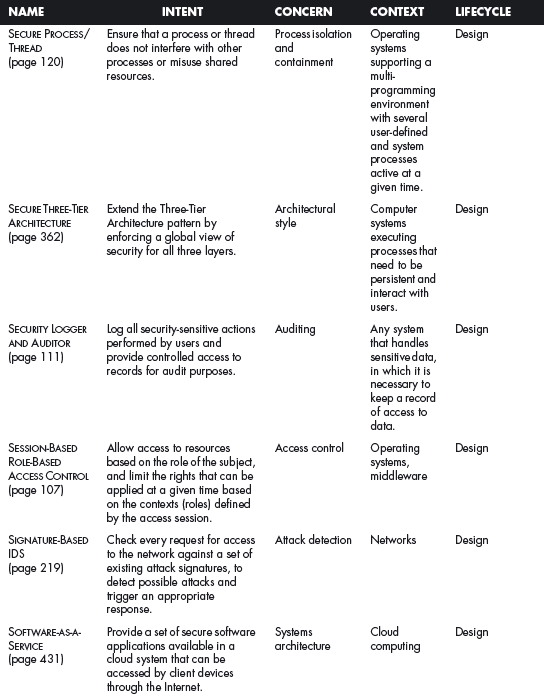

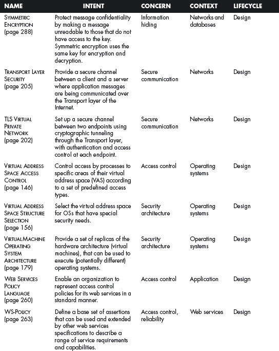

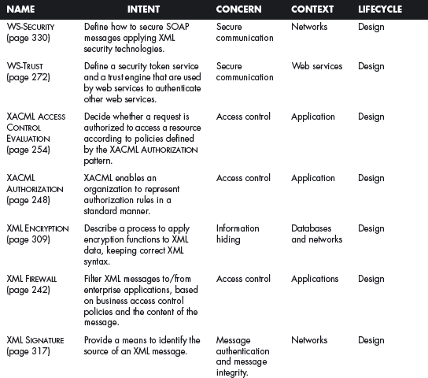

### MISUSE PATTERNS DESCRIBED IN THIS BOOK

### SECURITY PATTERNS DESCRIBED ELSEWHERE

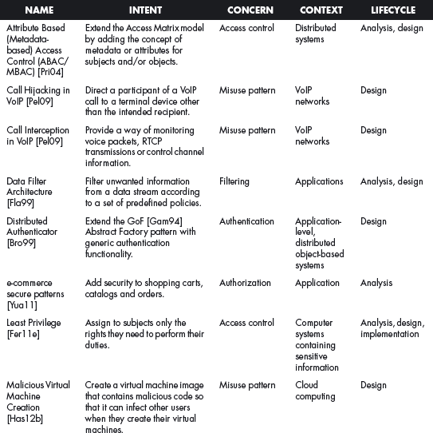

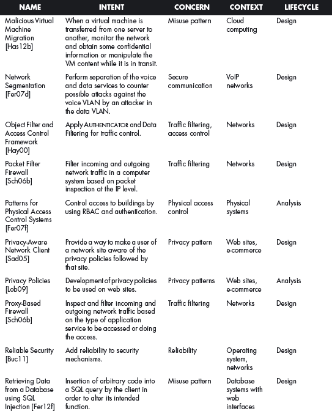

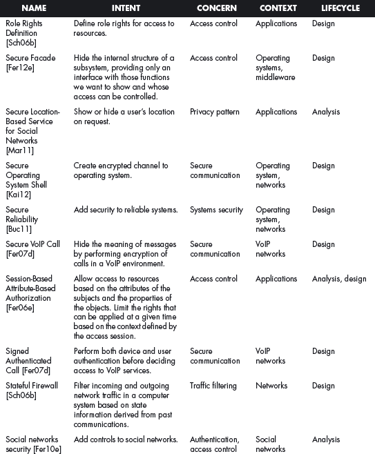

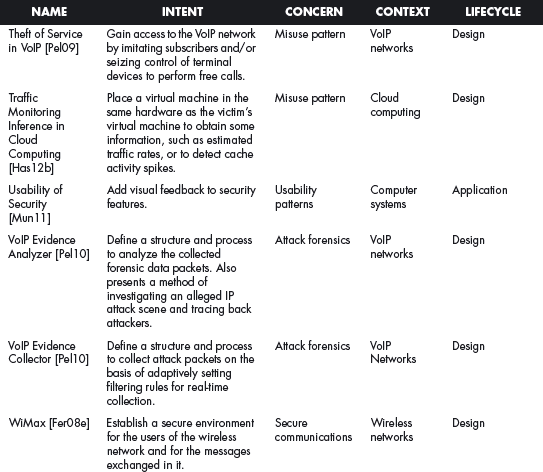

### SECURITY PATTERNS UNDER DEVELOPMENT

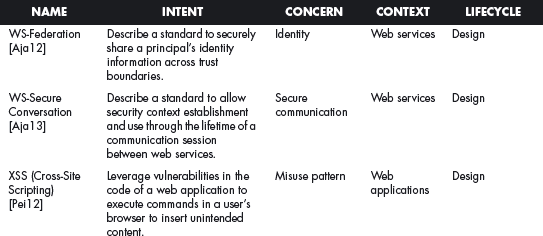

## 17.2 Future Research Directions for Security Patterns

This list is not complete, but indicates some interesting possibilities for future work.

- More security patterns. Important areas without patterns include database systems. Database views and query intersection are good candidates. Patterns that map OO models to relational databases could also be extended to map the security constraints defined in the OO model to the corresponding relational tables.

Patterns for administration is another area missing in patterns; we only showed one of this type, ADMINISTRATOR HIERARCHY (page 184). Also, we have only shown prevention patterns, but we need patterns for recovery from attacks, security planning and so on. Some planning patterns were presented in [Sch06b], but more are needed.

- Catalog of misuse patterns. We have written only a few misuse patterns (Chapter 14). We need more of them before they can be useful to evaluate systems (see Chapter 2). An appropriate classification of threats is an initial start in this direction [Uzu12d]. An enumeration of threats, for example for cloud systems, can identify required misuse patterns for this specific environment [Has12b].
- Improvements and extensions to the methodology. Secure methodologies usually don’t pay attention to process aspects; other work studies software processes, but does not consider security. We need to build flexible processes for secure systems development [Uzu12b].
- Security evaluation. As discussed in Chapter 3, we have proposed an evaluation method based on enumeration of threats. Methods based on formal models can prove specific parts of a system to be secure, and can be combined with other methods. Argument-based evaluation of systems is another possibility. We believe that a combination of these methods is very promising.
- Tools. The general guidance provided to the designer by a methodology can be complemented by tools. For example, in the analysis stage we could only show to the designer security patterns that apply to that stage. Pattern diagrams can help selection between similar patterns. A design assistant is needed. In fact, we see the lack of tools for building complete secure systems as a problem: most (all?) of the tools we know of only consider one part of the system. For example, the Samoa tools help in the design of secure web services in a Microsoft environment [MSR08]. Apparently one of them, the WSE Policy Advisor, uses security patterns. Other partial tools include support for pattern builders [Sch03] and support for threat enumeration [Bra09]. Another tool tries to help with the selection of patterns [Shi10].
- Analysis of the effect of changes. It is important to study the effect of changes in a system after it is built and put into operation. Changes occur for several reasons: new or changed requirements, performance improvement, expansion of the system to accommodate more users, technological advances in the platform devices and others. Often, the changes are not reflected in the original architecture model. From the architecture point of view, this is called ‘architecture erosion’. From a security point of view, we need to evaluate the effect of changes; very little work has been done on this aspect [Fer94b][oku11].
- Traceability. This is a necessary complement to the previous item; we need to know what components in the architecture are affected when a change is made. Tactics have been used for this purpose, but we believe that patterns are more suitable [Fer12d].
- Specialized applications. Some applications have unique requirements, and building them using a general approach may not result in the most secure system. Typical applications that require their own models include financial, medical, transportation and smart grid applications.
- Specialized environments. Some types of environments have a large effect on the applications running on them, and methodologies must be modified to consider that effect. Typical cases are systems built using web services [Fer12b], or cloud systems. Specialized patterns for those environments are also needed.
- Reliability, availability and safety requirements. We need to develop a process in which security and other nonfunctional aspects can be developed concurrently. These are areas that complement security, and we often need to define trade-offs between them and security. Sometimes we want to combine them with security, as we did in [Buc11], where we describe a fault-tolerant security pattern and a secure fault-tolerance pattern.
- Mapping across levels. Security constraints must be defined at the highest levels, where their semantics are clear. They must then be mapped to lower levels, where they are enforced by corresponding concrete mechanisms. We need precise ways to perform this mapping by taking advantage of the fact that the same type of patterns can be used at all levels [Fer99b].
- Integration of mobile systems into IT systems. ‘Bring your own device’ (BYOD) is the latest paradigm used in many institutions. The approach implies handling a variety of heterogeneous devices, with different capabilities, using different operating systems, different protocols and with their own variety of security systems. We discussed some of this in Chapter 16. We believe that patterns allow a convenient unification and integration of mobile devices with the rest of the information structure.
- Compliance with a variety of standards and regulations. Systems handling medical, financial or government records must comply with appropriate regulations. In addition, institutions have their own policies, which must be followed by all of their applications. It is possible to build patterns to satisfy any regulation or policy, and if we instantiate them in domain models, all applications derived from the domain model will automatically comply with the regulations [Fer11c]. We need patterns to express the policies of diverse regulations.

In summary, there are many possibilities for work on security patterns.

## 17.3 Security Principles

Building secure systems requires careful application of some principles. In my opinion, the most important principles are:

- Holistic approach. Cover all architectural levels and all units: we cannot have secure systems that are built piece-wise.
- Highest level. Security constraints must be defined where their semantics are clear, and propagated down the architectural levels of the system.
- Full mediation. Every request for resources must be evaluated and fulfilled only if authorized.
- Defense in depth. We need to have more than one line of defense.
- Closed system. Everything is forbidden unless explicitly authorized.
- Need-to-know. Assign only the necessary rights to perform functions.

Well-built patterns implicitly apply some of these principles, and our methodology helps in this respect.

## 17.4 The Future

Security patterns are still not as used as they should be. Once people know more about their effectiveness in building secure applications, they will be more used. To increase their use we need to:

- Improve the training of software developers. While large companies do some patterns training, smaller companies do not. To be able to apply security patterns, a designer first needs to be acquainted with patterns; in turn, to be proficient in the use of patterns, a designer needs to understand OO design and UML. We must convince them that they need to consider security as a fundamental design objective.
- Increase the technical level of security developers. Software development is still a pseudo-profession, in which people who do not have the proper background are assigned to the construction of critical software. The technical papers (white papers, development notes) of most companies in the US, and in some other countries, are written in a colloquial style, avoiding any formalism. Even UML diagrams are rarely shown, the idea being that only words and code are understandable to developers.

We believe that through the use of security patterns it is possible to write applications which are considerably more secure than current applications without experiencing serious development delays. Patterns emphasize holistic thinking, which is fundamental to producing secure systems. The current emphasis in industry in building fast and dirty code has resulted in a paradise for hackers; most of the attacks that have happened recently could have been avoided with a minimum set of defenses.

An interesting approach to producing secure architectures is the use of the ‘clean slate’ approach, which does not try to be compatible with existing architectures. Groups of researchers, sponsored by DARPA, are building this type of architecture. While we see our patterns of most value in designing and evaluating current systems, the collection of security ideas and principles embodied by these patterns can certainly be of value for this project.

Peter Neumann talks of cherry-picking the best ideas for building the systems of the future [Mar12]. A good collection of patterns can provide the ideas that have worked in the past.
